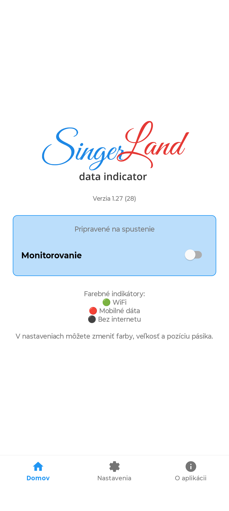
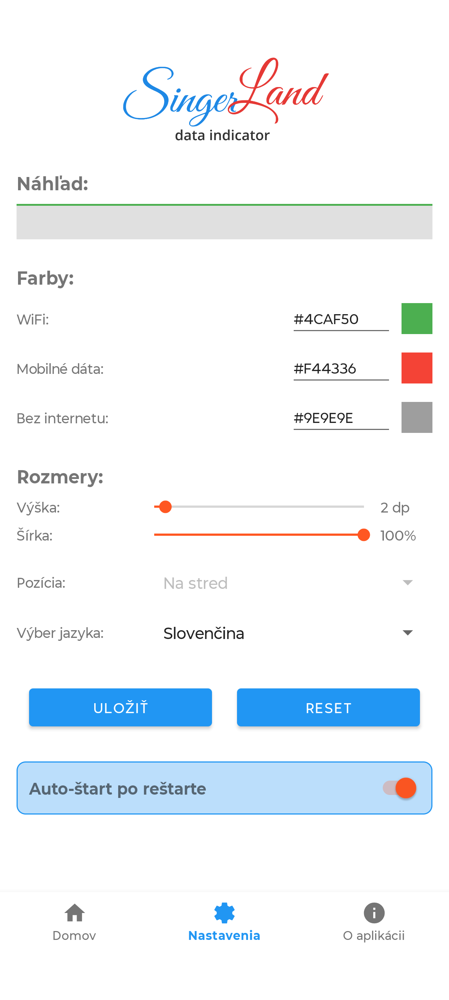
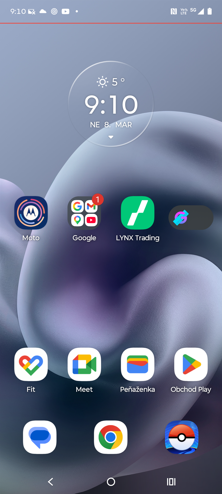

# DataIndicator

Pri cestovaní som potreboval identifikátor, či bežím na WiFi alebo idem na dátach, pretože sa mi viackrát stalo, že v roamingu som očakával, že som na WiFi, ale tá ma odpojila a mobil sa neznateľne prepol na dáta. Farebné označenie nevadí bežnému používaniu mobilu ani pri full screen pozeraní videa. Pokiaľ WiFi pripojenie padne počas pozerania videa, používateľ sa o tom okamžite dozvie.

Android aplikácia na trvalé zobrazenie tenkého farebného indikátora siete nad ostatnými aplikáciami.

## 🚀 Kľúčové Vlastnosti

* **Always-on overlay:** Indikátor je viditeľný aj nad inými aplikáciami.
* **Stav pripojenia v reálnom čase:** Wi‑Fi / mobilné dáta / bez internetu.
* **Prispôsobenie vzhľadu:** Farby, výška, šírka a zarovnanie pásika.
* **Autoštart po boote:** Aplikácia vie obnoviť monitorovanie po reštarte zariadenia.
* **Jednoduché nasadenie:** Build, podpis a inštalácia cez `Makefile`.

## 📱 Ukážky

| Hlavná obrazovka | Konfigurácia | Launcher |
| :---: | :---: | :---: |
|  |  |  |

| VLC Fullscreen 1 | VLC Fullscreen 2 | Vertikálne video |
| :---: | :---: | :---: |
|  |  |  |

## 🛠️ Technológie

* **Android Native:** Kotlin, Android SDK
* **Build System:** Gradle + Makefile
* **Kontajnerizovaný build:** Podman
* **Deploy:** ADB

## 📦 Inštalácia a Spustenie

### Prerekvizity
* Linux (testované)
* Podman
* Make
* Android SDK + ADB
* Android zariadenie s povoleným USB ladením (pre deploy)

### Príkazy

1. **Build APK**
```bash
make rebuild-apk
```

2. **Podpis APK**
```bash
make sign-apk
```

3. **Inštalácia do zariadenia**
```bash
make install-apk
```

4. **Kompletný deploy (build + sign + install)**
```bash
make deploy
```

## 🔐 Povolenia

Aplikácia používa:
* `SYSTEM_ALERT_WINDOW` — kreslenie overlay nad inými aplikáciami
* `FOREGROUND_SERVICE` — beh ako foreground služba
* `FOREGROUND_SERVICE_SPECIAL_USE` — kategória špeciálnej foreground služby
* `ACCESS_NETWORK_STATE` — detekcia typu sieťového pripojenia
* `INTERNET` — overenie skutočnej dostupnosti internetu
* `POST_NOTIFICATIONS` — zobrazenie notifikácie foreground služby
* `RECEIVE_BOOT_COMPLETED` — autoštart po reštarte zariadenia

## 🤖 Poznámka o AI

Tento projekt bol vygenerovaný a priebežne upravovaný pomocou AI.

## 📝 Licencia

Projekt je voľne použiteľný.

Kód môže ktokoľvek používať, upravovať a ďalej šíriť bez obmedzení.
